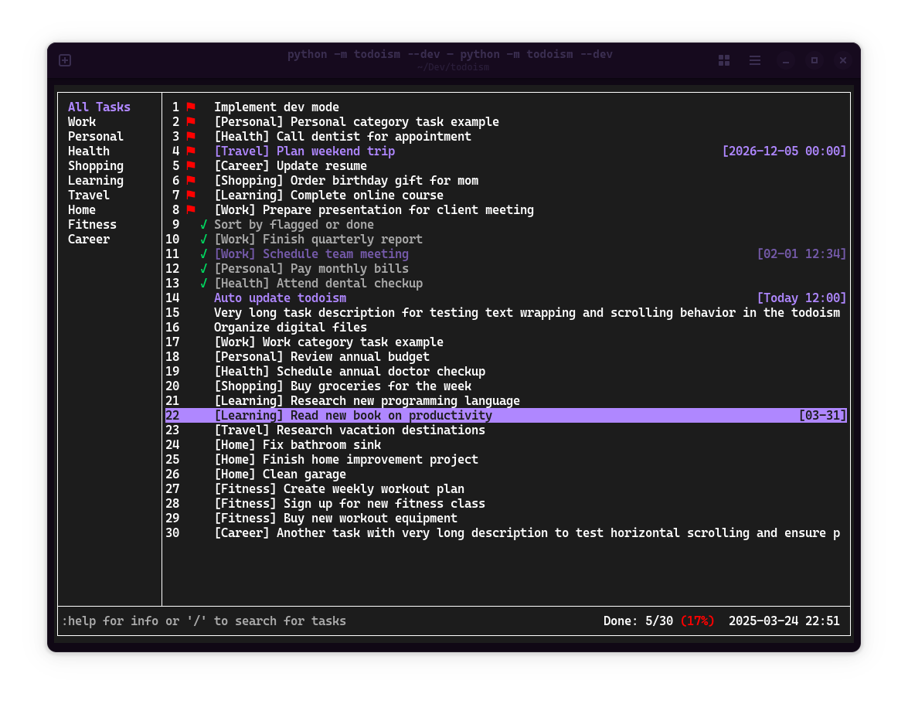
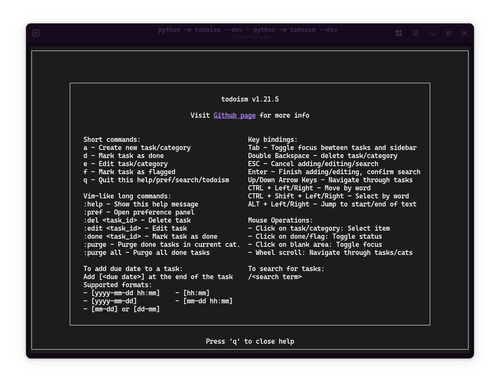

# todoism

A powerful yet easy-to-use todo TUI

## Screenshots

## Highlights

- Simple, intuitive interface
- Mouse support: click & scroll
- Easy task search
- Customizable: theme, sorting, and more
- Common Keyboard shortcuts support for editing
- Vim-like commands available for convenience

## Install and use

- Install: `pip install todoism`
- Run: `todoism` or `todo`
- Update: `pip install todoism --upgrade`
- Use: Invoke help message using command `:help` to see commonly used operations and commands

> [!NOTE]
> Some terminal does not support mouse click or strike through effect.
> E.g **Ptyxis** (new default terminal for GNOME 47) does not fully support strikethrough effect.
> You can turn it off in **preference panel** (open with `:pref` as specified in the help message)

### Keycode recording

When you first start todoism, you'll be prompted to record key combinations for text navigation.

- **CTRL + LEFT**: Move cursor one word left when editing text
- **CTRL + RIGHT**: Move cursor one word right when editing text
- **CTRL + SHIFT + LEFT**: Select text from cursor position to one word left
- **CTRL + SHIFT + RIGHT**: Select text from cursor position to one word right
- **ALT + LEFT**: Move cursor to the beginning of the text
- **ALT + RIGHT**: Move cursor to the end of the text

## Develop

- Run as module: `python -m todoism`, or `python -m todoism --dev` to run in dev mode, not available in PyPI installation)
- Use `:dev` and `:restore` to toggle between dev and normal mode, not specified in help message, not available in PyPI installation.

> [!CAUTION]
> Todoism is currently under active development and backwards compatibility is not guaranteed as I refine features and data structures. Automatic data migration (tasks, categories, settings) between versions may not be fully supported. Please backup your data (located in `~/.todoism/`) when needed. **v1.21 and lower versions are perticularly deprecated!**

## Contribute

Issues and PRs are welcome! Todoism uses curses library as its main tech stack. Please refer to the library [docs](https://docs.python.org/3/library/curses.html#module-curses) and [how-to](https://docs.python.org/3/howto/curses.html) to get started.
