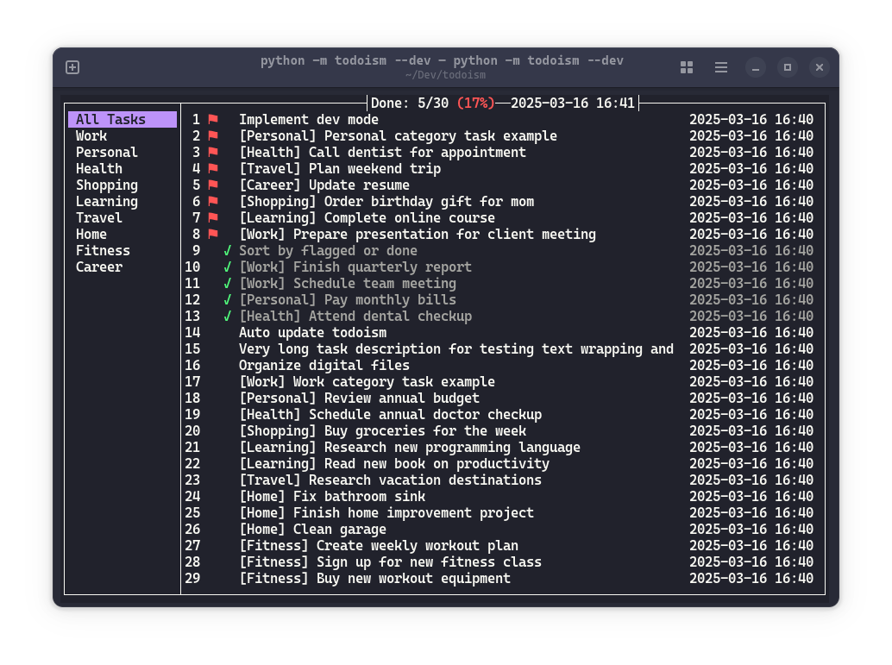
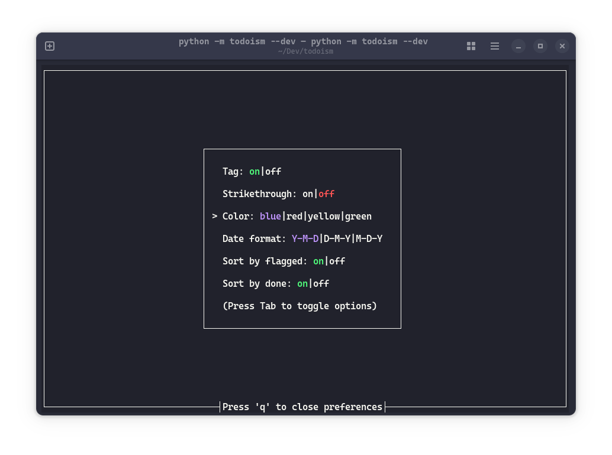

# todoism

A powerful yet easy-to-use todo TUI

## Screenshots




## Install and use

- Install: `pip install todoism`
- Run: `todoism` or `todo` 
- Update: `pip install todoism --upgrade`
- Use: Invoke help message using command `:help` to see commonly used operations and commands

## Develop

- Run as module: `python -m todoism`, or `python -m todoism --dev` to run in dev mode, not available in pip installation)
- Use `:dev` and `:restore` to toggle between dev and normal mode, not specified in help message, not available in pip installation.

```txt
┌──────────────────────────────────────────────────┐
│                                                  │
│   Short commands:                                │
│   a - Create new task/category                   │
│   d - Mark task as done                          │
│   e - Edit task/category                         │
│   f - Mark task as flagged                       │
│   q - Quit this help message/pref panel/todoism  │
│                                                  │
│   Key bindings:                                  │
│   Tab - Toggle focus bewteen tasks and sidebar   │
│   Double Backspace - delete task                 │
│   ESC - quit adding/editing task                 │
│   Enter - finish adding/editing task             │
│   Up/Down Arrow Keys - navigate through tasks    │
│   Mouse Click:                                   │
│    - on task: Select task                        │
│    - on category: Select category                │
│    - on done: Toggle task completion             │
│    - on flag: Toggle task flag                   │
│    - on blank area: toggle focus                 │
│                                                  │
│   Vim-like long commands:                        │
│   (:<command> [args])                            │
│   :help - Show this help message                 │
│   :pref - Open preference panel                  │
│   :del <task_id> - Delete task                   │
│   :edit <task_id> - Edit task                    │
│   :done <task_id> - Mark task as done            |
│   :purge - Purge all done tasks                  │
│                                                  │
└──────────────────────────────────────────────────┘
```

> [!NOTE]
> Some terminal does not support mouse click or strike through effect.
> E.g **Ptyxis** (new default terminal for GNOME 47) does not fully support strikethrough effect.
> You can turn it off use command `:st off`, as specified in the help message.

> [!CAUTION]
> Todoism is currently under active development and backwards compatibility is not guaranteed as I refine features and data structures. Automatic data migration (tasks, categories, settings) between versions is not yet implemented. Please backup your data (located in `~/.todoism/`) when needed.

### Keycode recording

When you first start todoism, you'll be prompted to record key combinations for text navigation.

- CTRL + LEFT: Move cursor one word left when editing text
- CTRL + RIGHT: Move cursor one word right when editing text
- CTRL + SHIFT + LEFT: Select text from cursor position to one word left
- CTRL + SHIFT + RIGHT: Select text from cursor position to one word right
- ALT + LEFT: Move cursor to the beginning of the text
- ALT + RIGHT: Move cursor to the end of the text

## Contribute

Issues and PRs are welcome! todoism uses curses library as its main tech stack. Please refer to the library [docs](https://docs.python.org/3/library/curses.html#module-curses) and [how-to](https://docs.python.org/3/howto/curses.html) to get started.
