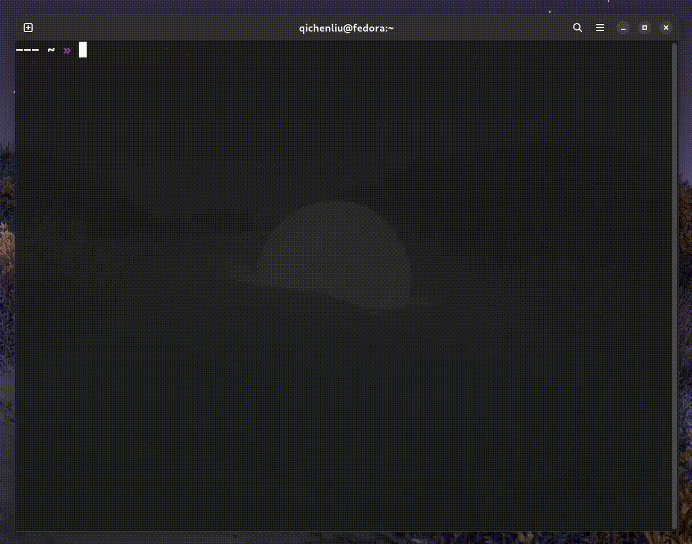

# todoism

An interactive and intuitive todo TUI

## Demo



## Install and use

- Install: `pip install todoism`
- Run: `todoism` or `todo`
- Update: `pip install todoism --upgrade`

```
┌──────────────────────────────────────────────────┐
│                                                  │
│   short commands:                                │
│   a - create new task                            │
│   d - mark task as done                          │
│   e - edit task                                  │
│   f - mark task as flagged                       │
│   q - quit this help message/todoism             │
│                                                  │
│   vim-like long commands:                        │            
│   (:<command> [args])                            │
│   :help - show this help message                 │
│   :purge - purge all done tasks                  │
│   :sort f - sort flagged tasks to top            │
│   :sort d - sort done tasks to bottom            │
│   :autosort f on|off                             │
│   :autosort d on|off                             │
│   :setcolor blue|red|yellow|green                │
│    - change background color of current task     │
│   :del [task_id] - delete task                   │
│   :edit [task_id] - edit task                    │
│   :done [task_id] - mark task as done            │
│                                                  │
│   other key bindings:                            │
│   double Backspace - delete task                 │
│   ESC - quit adding/editing task                 │
│   Enter - finish adding/editing task             │
│   Up/Down Arrow Keys - navigate through tasks    │
│                                                  │
└──────────────────────────────────────────────────┘
```

## ToDos

- **sidebar: categories**
- ~~apply post_deletion_update to command del~~
- update time regularly: seperate thread or
- commandline interface for e.g adding tasks
- ~~command: done xx~~
- set color random
- maybe restore prev current id and row at command edit as well
- properly display completed tasks
- maybe make autosort flag and done default
- grey background when adding new task using 'a'
- make status bar prettier: wrap it as a block
- done x,y,z
- stroke-through effect
- add chinese language support
- Caps commands
- make no-task message more helpful
- purge all
- command autosort
- emulate the popup menu when right click on task 
- esc to quit exit() too slow
- command: date ymd, dmy
- invalid command
- custom theme
- wrap a setup func for e.g paths
- add mouse support
- command print overwriting
- can not fully display help when window too small
- ctl + shift to select multiple tasks to delete/done
- ~~handle window size change~~
- group different kinds of tasks
- use repaint
- simplify print args
- history total done count in maybe settings
- max task count: 99 and message for it
- ~~message when task count == 1~~
- delete printing status bar except for time update
- ~~dynamic indent based on window size~~
- sound

## Contribute

Issues and PRs are welcome! todoism uses curses library as its main tech stack. Please refer to the library [docs](https://docs.python.org/3/library/curses.html#module-curses) and [how-to](https://docs.python.org/3/howto/curses.html) to get started.
